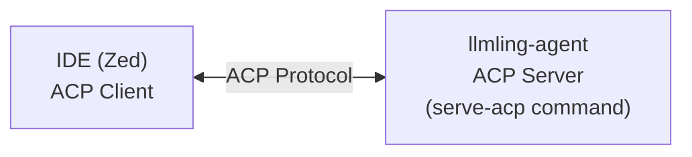
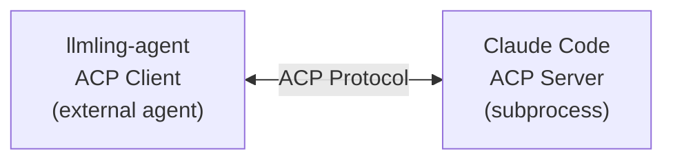
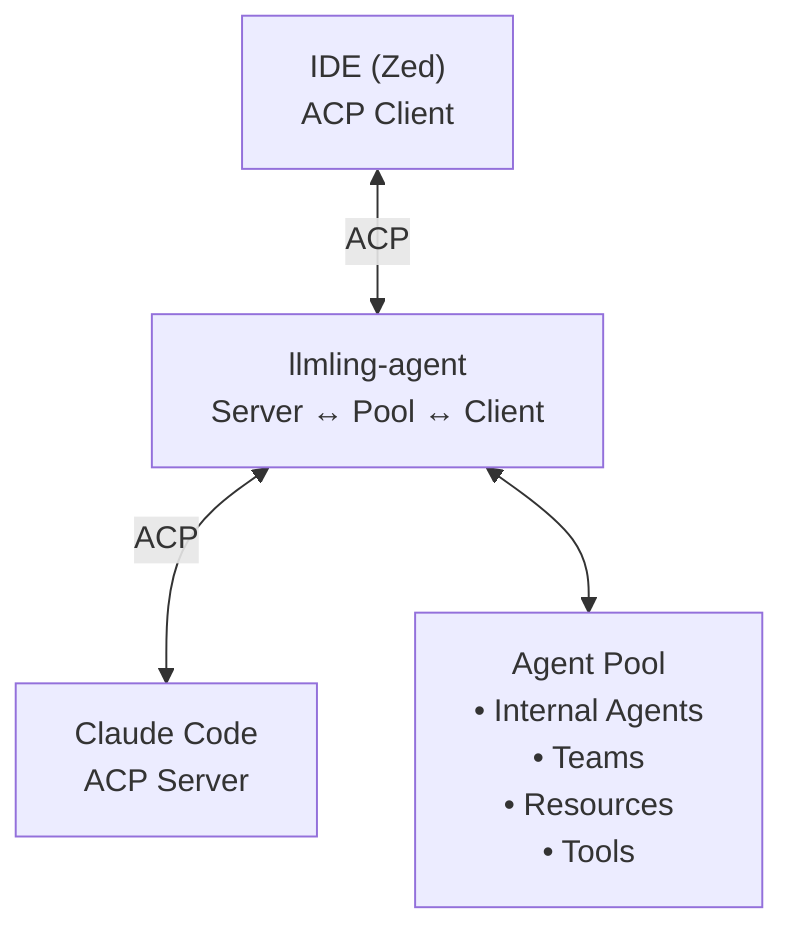

# ACP Integration

## What is ACP?

The Agent Client Protocol (ACP) is a standardized JSON-RPC 2.0 protocol that enables communication between code editors and AI agents. It allows llmling-agent to integrate seamlessly with desktop applications and IDEs that support the protocol.

ACP provides:
- Bidirectional communication between editor and agent
- Session management and conversation history
- File system operations with permission handling
- Terminal integration for command execution
- Support for multiple agents with mode switching
- MCP (Model Context Protocol) server integration

## ACP Agents as First-Class Citizens

In llmling-agent, external ACP agents are **first-class citizens** in the agent ecosystem. They:

- ✅ **Participate fully in the agent pool** - Can be discovered, delegated to, and coordinated with
- ✅ **Support most regular agent features** - Tools, contexts, delegation, state management
- ✅ **Run in configurable environments** - Local, Docker, E2B, remote sandboxes
- ✅ **Access internal toolsets** - Via automatic MCP bridge for supported agents
- ✅ **Maintain type safety** - Full Pydantic validation and typed configurations
- ✅ **Auto-managed lifecycle** - Automatic spawn, cleanup, and error handling

The key difference is that ACP agents run as **separate processes** communicating via the ACP protocol, while still appearing as integrated members of the pool to other agents.

## Installation & Setup

Using uvx for one-off usage:

```bash
uvx --python 3.13 llmling-agent[default]@latest serve-acp --help
```

## CLI Usage

### Basic Commands

Start an ACP server from a configuration file:

```bash
llmling-agent serve-acp agents.yml
```


### Available Options

- `--file-access/--no-file-access`: Enable file system operations (default: enabled)
- `--terminal-access/--no-terminal-access`: Enable terminal integration (default: enabled)
- `--session-support/--no-session-support`: Enable session loading (default: enabled)
- `--model-provider`: Specify model providers to search (can be repeated)
- `--show-messages`: Show message activity in logs
- `--log-level`: Set logging level (debug, info, warning, error)

## IDE Configuration

### Zed Editor

Add this configuration to your Zed `settings.json`:

```json
{
  "agent_servers": {
    "LLMling": {
      "command": "uvx",
      "args": [
        "--python",
        "3.13",
        "llmling-agent[default]@latest",
        "serve-acp",
        "https://raw.githubusercontent.com/phil65/llmling-agent/refs/heads/main/docs/examples/pick_experts/config.yml", # <- insert your agent config here
        "--model-provider",
        "openai"
      ],
      "env": {
        "OPENAI_API_KEY": "your-api-key-here"
      }
    }
  }
}
```

This configuration:

- Uses uvx to run the latest version without local installation
- Points to a remote configuration file with multiple expert agents
- Specifies OpenAI as the model provider
- Sets the required API key via environment variables

### Other IDEs

For IDEs that support ACP, the general pattern is:

1. Set the command to `llmling-agent` (or `uvx llmling-agent[default]@latest`)
2. Add `serve-acp` as the first argument
3. Specify your configuration file path
4. Add any desired CLI options
5. Set required environment variables (API keys, etc.)

## The ACP Bridge Concept

### llmling-agent as Both Server AND Client

Understanding llmling-agent's ACP integration requires grasping a key architectural concept: **llmling-agent acts as BOTH an ACP server AND an ACP client simultaneously**. This dual role is what makes the integration so powerful.

#### As an ACP Server (IDE Integration)

When you run `llmling-agent serve-acp`, it becomes an **ACP server** that IDEs can connect to:



In this mode, llmling-agent:
- Receives prompts from the IDE
- Sends back agent responses
- Handles file operations on behalf of the IDE
- Manages terminal sessions
- Provides multi-agent "modes" for the IDE to switch between

#### As an ACP Client (External Agent Integration)

At the same time, llmling-agent can act as an **ACP client** to integrate external ACP agents:



In this mode, llmling-agent:
- Spawns external ACP agent processes (Claude Code, Gemini CLI, etc.)
- Sends prompts to those agents
- Receives their responses
- Manages their lifecycle (startup, cleanup)
- Provides them access to internal toolsets via MCP

#### The Bridge: Both Roles Together

The real power comes when **both roles work together**:



#### Real-World Example

When you configure Zed to use llmling-agent with external ACP agents:

1. **Zed** connects to llmling-agent via ACP (IDE → Server)
2. **llmling-agent** maintains an agent pool with both:
   - Internal agents (regular Python-based agents)
   - External agents (spawned ACP processes like Claude Code)
3. When you send a prompt through Zed:
   - It goes to llmling-agent (Server role)
   - llmling-agent routes it to the appropriate agent
   - If the agent is internal → direct execution
   - If the agent is external → ACP client call to that subprocess
4. **Orchestration** becomes possible:
   - An internal agent can delegate to Claude Code
   - Claude Code can call back to internal agents via MCP toolsets
   - All coordinated through the agent pool

#### Why This Matters

This bridge architecture enables:

- ✅ **Unified interface**: IDE sees one server, regardless of how many agents
- ✅ **Heterogeneous agents**: Mix internal Python agents with external processes
- ✅ **Transparent delegation**: Agents can work together across process boundaries
- ✅ **Toolset sharing**: External agents access internal capabilities via MCP bridge
- ✅ **Environment flexibility**: External agents can run in Docker, E2B, remote servers
- ✅ **Protocol translation**: IDE ↔ ACP ↔ Internal Pool ↔ ACP ↔ External Agents

The key insight: **llmling-agent doesn't just implement ACP—it bridges multiple ACP worlds together into a unified orchestration layer**.

## Multi-Agent Modes

When your configuration includes multiple agents, the IDE will show a mode selector allowing users to switch between different agents mid-conversation.

Example configuration with multiple agents:

```yaml
agents:
  code_reviewer:
    name: "Code Reviewer"
    model: "openai:gpt-4"
    system_prompt: "You are an expert code reviewer..."

  documentation_writer:
    name: "Documentation Writer"
    model: "anthropic:gpt-5-nano"
    system_prompt: "You are a technical documentation expert..."

```

Each agent appears as a separate "mode" in the IDE interface, allowing users to:

- Switch between specialized agents for different tasks
- Maintain separate conversation contexts per agent
- Access agent-specific capabilities and tools

## External ACP Agents

llmling-agent can integrate external ACP-enabled agents (like Claude Code, Codex, Goose, etc.) into your agent pool through YAML configuration. This allows you to delegate tasks to specialized external agents while maintaining a unified interface.

### Configuration

Define external ACP agents in your manifest:

```yaml
# agents.yml
acp_agents:
  claude:
    type: claude
    display_name: "Claude Code"
    description: "Claude Code through ACP"
  
  codex:
    type: codex
    display_name: "Codex"
    description: "Codex Code through ACP"
  
  goose:
    type: goose
    display_name: "Goose"
    description: "Block's Goose agent through ACP"
  
  fast-agent:
    type: fast-agent
    display_name: "Fast Agent"
    description: "fast-agent through ACP"
    model: openai.gpt-4o

agents:
  coordinator:
    model: openai:gpt-5-mini
    toolsets:
      - type: agent_management  # Enables delegation to ACP agents
```

### Supported External Agents

#### MCP-Capable Agents (with Toolset Bridging)

These agents support MCP servers and can use internal llmling-agent toolsets:

- **claude**: Claude Code (Anthropic's coding assistant)
  - Full MCP support via `--mcp-config`
  - Permission modes, structured outputs
  - Tool filtering and access control
  
- **gemini**: Google's Gemini CLI
  - Native MCP integration
  - Configurable temperature, context window
  - Multi-modal support

- **auggie**: Augment Code
  - MCP support via `--mcp-config`
  - GitHub integration
  - Project context awareness

- **kimi**: Moonshot AI's Kimi CLI
  - MCP support via `--mcp-config`
  - Chinese language optimization
  - Work directory management

#### Standard ACP Agents

These agents use ACP protocol but don't support MCP toolset bridging:

- **codex**: OpenAI Codex (Zed integration)
- **opencode**: OpenCode agent
- **goose**: Block's Goose agent
- **fast-agent**: Fast Agent with configurable models
- **openhands**: OpenHands (formerly OpenDevin)
- **amp**: AmpCode agent
- **cagent**: Docker-based cagent
- **stakpak**: Stakpak Agent
- **vtcode**: VT Code agent

### Usage with Agent Pool

Once configured, external ACP agents are automatically available in the agent pool:

```python
from llmling_agent.delegation import AgentPool

async def main():
    async with AgentPool("agents.yml") as pool:
        # Access external ACP agents just like regular agents
        claude = pool.acp_agents["claude"]
        result = await claude.run("Refactor this code to use async/await")
        
        # Or delegate from a coordinator agent
        coordinator = pool.agents["coordinator"]
        result = await coordinator.run(
            "Use the Claude agent to review and improve the codebase"
        )
        
        # Check what agents are available
        print(f"Regular agents: {list(pool.agents.keys())}")
        print(f"ACP agents: {list(pool.acp_agents.keys())}")
```

The external agents are spawned as subprocess instances and communicate via the ACP protocol, with automatic lifecycle management and cleanup.

## ACP Agent Architecture

### How ACP Agents Operate

ACP agents in llmling-agent follow this execution model:

1. **Process Spawning**
   - Agent configuration defines command and arguments
   - Process spawned in configured execution environment
   - stdin/stdout used for JSON-RPC communication

2. **Protocol Initialization**
   - Client sends `initialize` request with capabilities
   - Agent responds with its capabilities (MCP support, etc.)
   - Session negotiation completes

3. **Session Management**
   - `new_session` request creates working session
   - MCP servers passed during session creation
   - Working directory and permissions established

4. **Message Exchange**
   - Prompts sent via `session/prompt` requests
   - Streaming responses via session updates
   - Tool calls handled through MCP or native protocols

5. **Lifecycle Management**
   - Automatic cleanup on pool exit
   - Process termination and resource cleanup
   - Error handling and recovery

### Execution Environments

ACP agents can run in different environments based on configuration:

```yaml
acp_agents:
  claude_local:
    type: claude
    execution_environment: local  # Default
    
  claude_docker:
    type: claude
    execution_environment:
      type: docker
      image: python:3.13-slim
      
  claude_e2b:
    type: claude
    execution_environment:
      type: e2b
      template: python-sandbox
      
  claude_remote:
    type: claude
    execution_environment:
      type: srt  # Secure Remote Terminal
      host: remote-server.com
```

**Environment types:**

- **local**: Run on local machine (default)
- **docker**: Run in Docker container with specified image
- **e2b**: Run in E2B sandbox (cloud sandboxes)
- **beam**: Run on Beam Cloud infrastructure
- **daytona**: Run in Daytona development environment
- **srt**: Run on remote server via Secure Remote Terminal

The execution environment handles:
- File system access (sandboxed or real)
- Terminal operations (bash, command execution)
- Network access controls
- Resource limits and isolation

### Permission Model

ACP agents have fine-grained permission controls:

```yaml
acp_agents:
  restricted_claude:
    type: claude
    allow_file_operations: false  # Disable file read/write
    allow_terminal: false         # Disable terminal access
    auto_grant_permissions: false # Require user confirmation
    permission_mode: dontAsk      # Claude-specific: deny by default
```

Permissions are enforced at multiple levels:
- **Client side**: llmling-agent's ACPClientHandler validates requests
- **Agent side**: External agent's own permission system
- **Environment side**: Execution environment provides isolation

## Toolset Bridging via MCP

### Overview

For MCP-capable ACP agents (Claude, Gemini, Auggie, Kimi), llmling-agent can automatically expose internal toolsets via an in-process MCP server bridge. This allows external agents to use powerful internal capabilities like subagent delegation, agent management, and custom tools.

### How It Works

1. **Configuration**: Declare toolsets in agent config
2. **Bridge Creation**: ToolManagerBridge spawns HTTP/SSE MCP server
3. **Registration**: Tools registered with FastMCP server
4. **Session Integration**: MCP server URL passed to agent session
5. **Tool Invocation**: Agent calls tools via standard MCP protocol
6. **Context Bridging**: Calls proxied to internal tools with full context

The bridge runs **in-process** on the same event loop as the agent pool, providing zero-latency access to pool state while exposing a standard network interface to the external agent.

### Configuration Example

```yaml
acp_agents:
  claude_orchestrator:
    type: claude
    description: "Claude with delegation capabilities"
    permission_mode: acceptEdits
    toolsets:
      # Subagent delegation tools
      - type: subagent
      
      # Agent lifecycle management
      - type: agent_management
      
      # Custom tools
      - type: custom
        tools:
          - my_custom_tool
          
agents:
  specialist_a:
    model: openai:gpt-4
    system_prompt: "Expert in data processing"
    
  specialist_b:
    model: anthropic:claude-sonnet-4
    system_prompt: "Expert in API design"
```

With this configuration, the Claude agent can:
- List available agents via `list_available_nodes`
- Delegate work via `delegate_to` or `ask_agent`
- Create new agents dynamically via `add_agent`
- Use any custom tools you've registered

### Available Toolsets

All standard toolsets can be exposed to MCP-capable agents:

- **subagent**: Delegation tools (`delegate_to`, `ask_agent`, `list_available_nodes`)
- **agent_management**: Lifecycle tools (`add_agent`, `remove_agent`, `get_agent_info`)
- **search**: Web/news search (requires provider configuration)
- **notifications**: Send notifications via Apprise
- **semantic_memory**: Vector-based memory and retrieval
- **custom**: Your own tools via ResourceProvider

### Usage Example

Once configured, the external agent automatically has access to the tools:

```python
async with AgentPool("config.yml") as pool:
    claude = pool.acp_agents["claude_orchestrator"]
    
    # Claude can now delegate to internal agents
    result = await claude.run(
        "Use the list_available_nodes tool to see what agents are available, "
        "then delegate the data processing task to specialist_a"
    )
    
    # The tool bridge handles the MCP protocol translation
    # and injects proper AgentContext for internal tool execution
```

### Tool Bridge Architecture


**Key Features:**

- **Zero IPC overhead**: Bridge runs in same process as pool
- **Type-safe**: Full type checking from tool definition to MCP
- **Context injection**: Tools receive proper AgentContext with pool access
- **Auto-discovery**: Tools automatically exposed, no manual registration
- **Per-agent isolation**: Each ACP agent gets its own bridge instance
- **Clean lifecycle**: Bridges automatically cleaned up with pool

### Advanced Configuration

For more control over the bridge:

```yaml
acp_agents:
  claude_advanced:
    type: claude
    toolsets:
      - type: subagent
        # Toolset-specific config here
        
      - type: custom
        tools:
          - only_specific_tool
          
    # Additional MCP servers (alongside toolset bridge)
    mcp_servers:
      - name: filesystem
        type: stdio
        command: npx
        args: ["-y", "@modelcontextprotocol/server-filesystem", "/project"]
        
      - name: external-api
        type: sse
        url: https://api.example.com/mcp
```

The agent will have access to:
1. **Internal toolsets** via automatic bridge
2. **External MCP servers** you explicitly configure
3. **Agent's built-in tools** (if any)

### Security Considerations

Toolset bridging is secure by design:

- ✅ **Explicit opt-in**: Only agents with `toolsets` field get bridges
- ✅ **Scoped access**: Tools see only what AgentContext provides
- ✅ **Permission gates**: Input providers can confirm dangerous operations
- ✅ **Network isolation**: Bridge binds to localhost by default
- ✅ **Process isolation**: External agent runs in separate process
- ✅ **Environment sandboxing**: Execution environment provides additional isolation

Best practices:
- Use `allow_file_operations: false` for read-only agents
- Use `auto_grant_permissions: false` for sensitive operations
- Use sandboxed execution environments (Docker, E2B) for untrusted agents
- Limit toolsets to only what the agent needs

## Configuration

### Remote Configurations

You can reference remote configuration files directly:

```bash
llmling-agent serve-acp https://example.com/config.yml
```


### Provider Selection

Limit which providers are searched for models:

```bash
llmling-agent serve-acp config.yml --model-provider openai --model-provider anthropic
```

If not provider is passed, OpenRouter is used.

Available model providers:

- `anthropic`
- `groq`
- `mistral`
- `openai`
- `openrouter`
- `github`
- `copilot`
- `cerebras`
- `gemini`
- `cohere`
- `deepseek`
- `requesty`
- `xai`
- `comet`
- `novita`
- `vercel-gateway`
- `chutes`
- `cortecs`
- `azure`
- `fireworks-ai`
- `ollama`
- `moonshotai`
- `zai`

The providers depend on environment variables being set, like `OPENAI_API_KEY`, `OPENROUTER_API_KEY`, etc.
