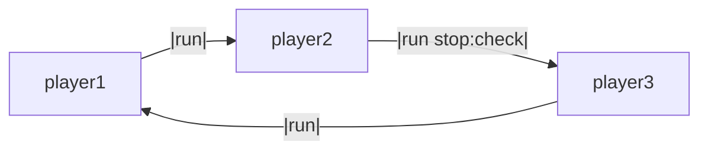

## Try it in Pydantic Playground


## Files

- `config.yml`
- `main.py`


# Round-Robin Communication


### `config.yml`

```yml
# yaml-language-server: $schema=https://raw.githubusercontent.com/phil65/llmling-agent/refs/heads/main/schema/config-schema.json
prompts:
  system_prompts:
    word_chain:
      category: role
      content: |
        "Append one word to the given word or sentence and continue the sentence indenfinitely."

agents:
  player1:
    model: openai:gpt-5-mini
    system_prompts:
      - type: library
        reference: word_chain
    connections:
      - type: node
        name: player2
        connection_type: run

  player2:
    model: openai:gpt-5-mini
    system_prompts:
      - type: library
        reference: word_chain
    connections:
      - type: node
        name: player3
        connection_type: run
        stop_condition:
          type: cost_limit
          max_cost: 0.01 # stop circle when this agent reaches 0.01 cost

  player3:
    model: openai:gpt-5-mini
    system_prompts:
      - type: library
        reference: word_chain
    connections:
      - type: node
        name: player1
        connection_type: run

```


### `main.py`

```py
# /// script
# dependencies = ["llmling-agent"]
# ///

"""Run round-robin example demonstrating cyclic communication pattern."""

from __future__ import annotations

import os

from llmling_agent.__main__ import run_command  # type: ignore[attr-defined]
from llmling_agent_docs.examples.utils import get_config_path, is_pyodide


# set your OpenAI API key here
os.environ["OPENAI_API_KEY"] = os.environ.get("OPENAI_API_KEY", "your_api_key_here")


if __name__ == "__main__":
    # Use utils to get config path that works in both environments
    config_path = get_config_path(None if is_pyodide() else __file__)

    run_command(
        node_name="player1",
        prompts=["Start the word chain with: tree"],
        config_path=str(config_path),
        show_messages=True,
        detail_level="simple",
        show_metadata=False,
        show_costs=False,
        verbose=False,
    )

```


This example demonstrates how to set up a cyclic communication pattern between agents using LLMling's connection system.



!!! note
    Mermaid diagrams can be generated using pool.get_mermaid_diagram() for a whole pool, as well as
    ConnectionManager.get_mermaid_diagram() for a single agent.

## Running the Example

Start the chain by sending a word to player1:

```bash
llmling-agent run player1 "start" --show-messages
```

Example output:
```
player1: "tree"
player2: "elephant"
player3: "tiger"
player1: "robot"
...
```

## How it Works

1. Each agent is configured with the same system prompt defining the word chain game
2. Agents are connected in a circle: player1 -> player2 -> player3 -> player1
3. Messages flow through the connections automatically
4. Optional stop condition can terminate the loop when needed


## Adding Controls

You can add various conditions to control the conversation:

- Stop condition to end the chain based on cost/tokens/messages
- Transform function to modify messages
- Filter condition to control which messages pass through

