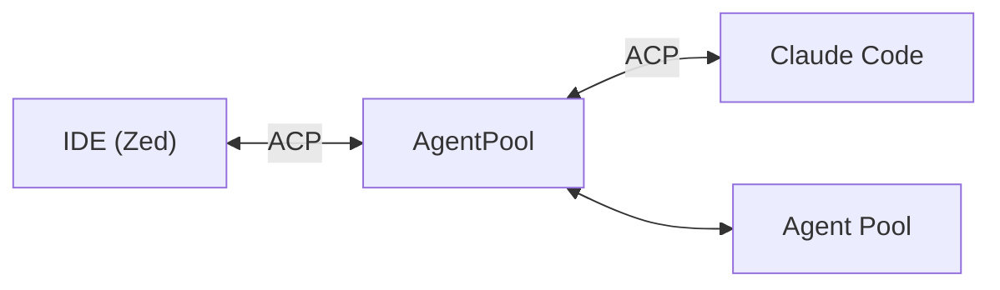

# ACP Server

The ACP (Agent Communication Protocol) server enables AgentPool to integrate with desktop applications and IDEs like Zed that support the protocol.

## What is ACP?

ACP is a standardized JSON-RPC 2.0 protocol that provides:

- Bidirectional communication between editor and agent
- Session management and conversation history
- File system operations with permission handling
- Terminal integration for command execution
- Tool confirmation modes for different workflows

## Quick Start

```bash
# Using uvx (no installation required)
uvx --python 3.13 agentpool[default]@latest serve-acp config.yml

# Or with installed package
agentpool serve-acp config.yml
```

See [`serve-acp`](../cli/serve-acp.md) for all CLI options.

## IDE Configuration

### Zed Editor

Add to your Zed `settings.json`:

```json
{
  "agent_servers": {
    "AgentPool": {
      "command": "uvx",
      "args": [
        "--python", "3.13",
        "agentpool[default,coding]@latest",
        "serve-acp",
        "path/to/config.yml",
        "--model-provider", "openai"
      ],
      "env": {
        "OPENAI_API_KEY": "your-api-key"
      }
    }
  }
}
```

### Other IDEs

For IDEs that support ACP:

1. Set command to `agentpool` or `uvx agentpool[default]@latest`
2. Add `serve-acp` as first argument
3. Specify your configuration file
4. Add CLI options as needed
5. Set required environment variables

## Agent Configuration

```yaml
# config.yml
agents:
  assistant:
    type: native
    model: openai:gpt-4o
    display_name: "AI Assistant"
    system_prompt: "You are a helpful coding assistant."
    toolsets:
      - type: file_access
      - type: execution
      - type: search
```

## Tool Confirmation Modes

The IDE's mode selector controls tool confirmation behavior:

| Mode | Behavior |
|------|----------|
| Auto-approve | Tools execute without confirmation |
| Confirm destructive | Only confirm writes, deletes, commands |
| Confirm all | Confirm every tool execution |

## The ACP Bridge

AgentPool acts as **both** an ACP server and client:



This enables:

- **IDE → AgentPool**: IDE connects to your agents
- **AgentPool → External Agents**: Delegate to Claude Code, Codex, etc.
- **Unified orchestration**: Mix internal and external agents

## External ACP Agents

Integrate external ACP agents into your pool:

```yaml
agents:
  claude:
    type: acp
    provider: claude
    display_name: "Claude Code"
    
  coordinator:
    type: native
    model: openai:gpt-4o
    toolsets:
      - type: agent_management  # Can delegate to claude
```

### Supported Providers

**MCP-Capable** (with toolset bridging):

- `claude` - Claude Code
- `gemini` - Google Gemini CLI
- `auggie` - Augment Code
- `kimi` - Moonshot Kimi CLI

**Standard ACP**:

- `codex` - OpenAI Codex
- `opencode` - OpenCode
- `goose` - Block's Goose
- `fast-agent` - Fast Agent
- `openhands` - OpenHands

## Execution Environments

ACP agents can run in different environments:

```yaml
agents:
  claude_docker:
    type: acp
    provider: claude
    execution_environment:
      type: docker
      image: python:3.13-slim
      
  claude_e2b:
    type: acp
    provider: claude
    execution_environment:
      type: e2b
      template: python-sandbox
```

Available environments: `local`, `docker`, `e2b`, `beam`, `daytona`, `srt`

## Toolset Bridging

MCP-capable agents can access internal toolsets:

```yaml
agents:
  claude_orchestrator:
    type: acp
    provider: claude
    toolsets:
      - type: subagent        # Delegation tools
      - type: agent_management # Lifecycle tools
      - type: search          # Web search
```

AgentPool automatically creates an MCP bridge, exposing these tools to the external agent.

## Permissions

Fine-grained permission control:

```yaml
agents:
  restricted:
    type: acp
    provider: claude
    allow_file_operations: false
    allow_terminal: false
    auto_grant_permissions: false
```

## See Also

- [OpenCode Server](opencode-server.md) - REST/SSE server for OpenCode clients
- [MCP Server](mcp-server.md) - Expose tools via MCP
- [External ACP Agents](../configuration/node-types/acp-agents.md) - Detailed agent configuration
