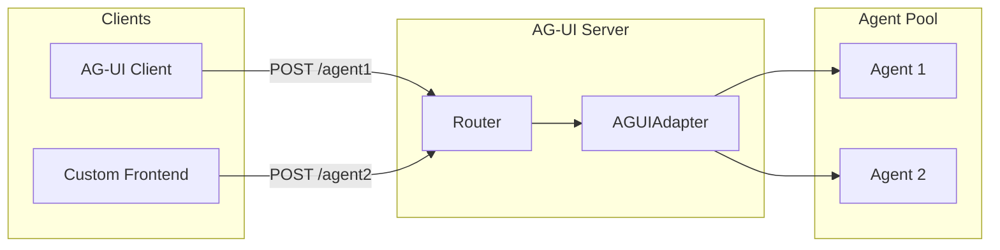

# AG-UI Server

The AG-UI server exposes AgentPool agents through the [AG-UI protocol](https://docs.ag-ui.com/), enabling integration with AG-UI compatible clients and frontends.

## Overview

AG-UI (Agent User Interface) is a standardized protocol for building agent interfaces. The AG-UI server makes each agent in your pool available at its own endpoint, providing a consistent API for agent interaction.

```
POST http://localhost:8002/agent1  -> Agent 1
POST http://localhost:8002/agent2  -> Agent 2
GET  http://localhost:8002/        -> List all agents
```

## Quick Start

```bash
# Run with default settings
agentpool serve-agui config.yml

# Custom host and port
agentpool serve-agui config.yml --host 0.0.0.0 --port 8002
```

See [`serve-agui`](../cli/serve-agui.md) for all CLI options.

## Programmatic Usage

```python
import anyio
from agentpool import AgentPool
from agentpool_server.agui_server import AGUIServer


async def main():
    pool = AgentPool()
    await pool.add_agent("assistant", model="openai:gpt-4")
    
    server = AGUIServer(pool, host="localhost", port=8002)
    
    async with server, server.run_context():
        # Server running at http://localhost:8002
        # Agent available at POST http://localhost:8002/assistant
        await anyio.sleep_forever()


anyio.run(main)
```

## API Endpoints

### List Agents

```
GET /
```

Returns a list of all available agents:

```json
{
  "agents": [
    {
      "name": "assistant",
      "route": "/assistant",
      "model": "openai:gpt-4"
    },
    {
      "name": "coder",
      "route": "/coder",
      "model": "anthropic:claude-sonnet-4-20250514"
    }
  ],
  "count": 2
}
```

### Interact with Agent

```
POST /{agent_name}
```

Send requests to a specific agent using the AG-UI protocol. The server uses pydantic-ai's `AGUIAdapter.dispatch_request()` to handle the full AG-UI protocol, including:

- Request parsing
- Agent execution
- Streaming responses

## Architecture



## Configuration

### Agent Configuration

```yaml
# config.yml
agents:
  assistant:
    type: chat
    model: openai:gpt-4
    system_prompt: "You are a helpful assistant."
    
  coder:
    type: claude_code
    model: anthropic:claude-sonnet-4-20250514
    tools:
      - type: file_access
      - type: process_management
```

Each agent becomes available at its own route (`/assistant`, `/coder`, etc.).

## Server Methods

The `AGUIServer` class provides helpful methods for working with agents:

```python
# Get URL for a specific agent
url = server.get_agent_url("assistant")
# Returns: "http://localhost:8002/assistant"

# List all agent routes
routes = server.list_agent_routes()
# Returns: {"assistant": "http://localhost:8002/assistant", ...}
```

## Use Cases

### Building Custom Frontends

AG-UI provides a standardized protocol for building agent interfaces, making it easy to create custom frontends:

```javascript
// JavaScript client example
const response = await fetch('http://localhost:8002/assistant', {
  method: 'POST',
  headers: { 'Content-Type': 'application/json' },
  body: JSON.stringify({
    // AG-UI request format
    messages: [{ role: 'user', content: 'Hello!' }]
  })
});
```

### Multi-Agent Applications

Expose multiple specialized agents through a single server:

```yaml
agents:
  writer:
    model: openai:gpt-4
    system_prompt: "You are a creative writer."
    
  reviewer:
    model: anthropic:claude-sonnet-4-20250514
    system_prompt: "You review and improve text."
    
  translator:
    model: openai:gpt-4
    system_prompt: "You translate text between languages."
```

Each agent is independently accessible, allowing clients to route requests to the appropriate specialist.
