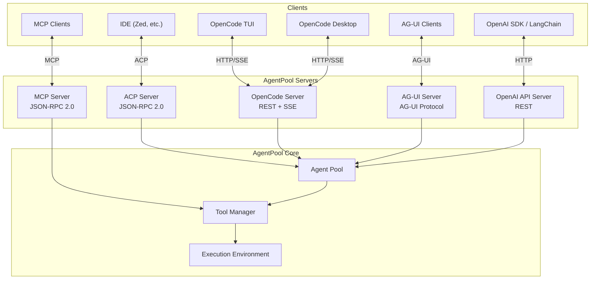

# Server Integrations

AgentPool can expose agents through multiple server protocols, enabling integration with different clients, IDEs, and tools.

## Available Servers

| Server | Protocol | Use Case | CLI Command |
|--------|----------|----------|-------------|
| [ACP Server](acp-server.md) | Agent Communication Protocol | IDE integration (Zed, etc.) | `agentpool serve-acp` |
| [OpenCode Server](opencode-server.md) | OpenCode REST + SSE | OpenCode TUI/Desktop | `agentpool serve-opencode` |
| [MCP Server](mcp-server.md) | Model Context Protocol | Expose tools to other agents | `agentpool serve-mcp` |
| [AG-UI Server](agui-server.md) | AG-UI Protocol | AG-UI compatible clients | `agentpool serve-agui` |
| [OpenAI API Server](openai-api-server.md) | OpenAI API | Drop-in OpenAI replacement | `agentpool serve-api` |

## Architecture Overview



## Choosing a Server

### ACP Server

Best for:

- **IDE integration** - Zed, and other ACP-compatible editors
- **Bidirectional communication** - Real-time tool confirmations
- **Session management** - Persistent conversations with history
- **File operations** - IDE-controlled file access

### OpenCode Server

Best for:

- **OpenCode TUI** - Terminal-based interface
- **OpenCode Desktop** - Electron desktop app
- **Remote agents** - Agents operating on remote filesystems (Docker, SSH, cloud)
- **REST API access** - Programmatic access via standard HTTP

### MCP Server

Best for:

- **Tool exposure** - Make your tools available to other agents
- **Resource sharing** - Share files, data, and prompts
- **Agent composition** - Let external agents use your capabilities

### AG-UI Server

Best for:

- **AG-UI protocol** - Standard agent interface protocol
- **Custom frontends** - Building your own agent UIs
- **Multi-agent routing** - Each agent at its own endpoint

### OpenAI API Server

Best for:

- **Drop-in replacement** - Use existing OpenAI client code
- **LangChain integration** - Works with LangChain and other OpenAI-compatible tools
- **API gateway** - Expose multiple models through unified API

## Quick Start

### Running Multiple Servers

You can run multiple servers simultaneously:

```bash
# Terminal 1: ACP for IDE
agentpool serve-acp config.yml

# Terminal 2: OpenCode for TUI
agentpool serve-opencode config.yml --port 4096

# Terminal 3: MCP for tool sharing
agentpool serve-mcp config.yml

# Terminal 4: AG-UI for custom frontends
agentpool serve-agui config.yml --port 8002

# Terminal 5: OpenAI API for SDK compatibility
agentpool serve-api config.yml --port 8000
```

### Common Configuration

All servers share the same agent configuration:

```yaml
# config.yml
agents:
  assistant:
    type: claude_code
    display_name: "AI Assistant"
    tools:
      - type: file_access
      - type: process_management
      - type: search
```

The same pool of agents is accessible through any server protocol.
