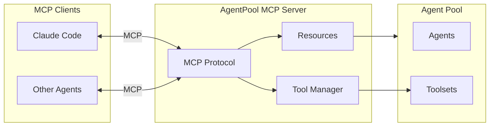

# MCP Server

The MCP (Model Context Protocol) server exposes AgentPool tools, resources, and prompts to external MCP clients, enabling other agents and applications to use your capabilities.

## What is MCP?

MCP is a standardized protocol for AI tool integration:

- **Tools** - Functions that agents can call
- **Resources** - Data and files agents can read
- **Prompts** - Reusable prompt templates
- **Sampling** - Request completions from the client

## Quick Start

```bash
# Expose tools from a pool
agentpool serve-mcp config.yml

# Or expose specific toolsets
agentpool serve-mcp config.yml --toolset file_access --toolset search
```

See [`serve-mcp`](../cli/serve-mcp.md) for all CLI options.

## Use Cases

### 1. Share Tools with Claude Code

Expose your custom tools to Claude Code:

```bash
# Start MCP server
agentpool serve-mcp tools.yml --transport sse --port 3001
```

Configure Claude Code's `mcp.json`:

```json
{
  "mcpServers": {
    "agentpool": {
      "url": "http://localhost:3001/sse"
    }
  }
}
```

### 2. Agent Composition

Let external agents use your pool's capabilities:

```yaml
# config.yml - Your pool with specialized agents
agents:
  data_expert:
    type: native
    model: openai:gpt-4o
    system_prompt: "Expert in data processing"
    
  api_expert:
    type: native
    model: anthropic:claude-sonnet
    system_prompt: "Expert in API design"
    
tools:
  - type: subagent  # Exposes delegate_to, ask_agent
```

External agents can now delegate to your experts via MCP.

### 3. Share Custom Tools

Expose custom Python functions:

```python
from agentpool import Agent
from agentpool.tools import tool

@tool
def analyze_data(data: str) -> str:
    """Analyze the provided data."""
    # Your analysis logic
    return f"Analysis result: {result}"

agent = Agent("analyzer", model="...", tools=[analyze_data])
```

```bash
agentpool serve-mcp --config agent.yml
```

## Exposed Capabilities

### Tools

All enabled tools from configured toolsets:

```yaml
tools:
  - type: file_access    # read, write, list_directory
  - type: process_management      # run_command, run_python
  - type: search         # web_search, news_search
  - type: subagent       # delegate_to, ask_agent, list_nodes
```

### Resources

Resources from configured resource providers:

```yaml
resources:
  - type: file
    path: /data
    pattern: "*.json"
```

### Prompts

MCP prompts from connected MCP servers are re-exposed:

```yaml
mcp_servers:
  - "uvx prompt-server"  # Prompts become available
```

## Architecture



## Transport Types

### stdio (Default)

For subprocess communication:

```bash
agentpool serve-mcp config.yml --transport stdio
```

Used when the client spawns the server as a subprocess.

### SSE (Server-Sent Events)

For HTTP-based communication:

```bash
agentpool serve-mcp config.yml --transport sse --port 3001
```

Used for network-accessible servers.

## Programmatic Usage

```python
from agentpool.mcp_server import serve_mcp
from agentpool import Agent

async def main():
    agent = Agent("assistant", model="openai:gpt-4o")
    
    async with agent:
        # Serve tools via MCP
        await serve_mcp(
            agent=agent,
            transport="sse",
            port=3001,
        )
```

## Security Considerations

When exposing tools via MCP:

- **Network exposure**: SSE transport is network-accessible
- **Tool permissions**: All exposed tools can be called
- **Resource access**: Exposed resources are readable
- **No authentication**: MCP doesn't have built-in auth

Best practices:

- Bind to localhost for local-only access
- Use firewall rules for network deployment
- Limit exposed toolsets to what's needed
- Use read-only resources when possible

## Consuming MCP Servers

AgentPool can also **consume** MCP servers (act as client):

```yaml
agents:
  my_agent:
    mcp_servers:
      - type: stdio
        command: uvx
        args: ["some-mcp-server"]
        
      - type: sse
        url: http://localhost:3001/sse
```

See [MCP Server Integration](../advanced/mcp-servers.md) for consuming MCP servers.

## See Also

- [ACP Server](acp-server.md) - For IDE integration
- [OpenCode Server](opencode-server.md) - For OpenCode clients
- [MCP Server Integration](../advanced/mcp-servers.md) - Consuming MCP servers
