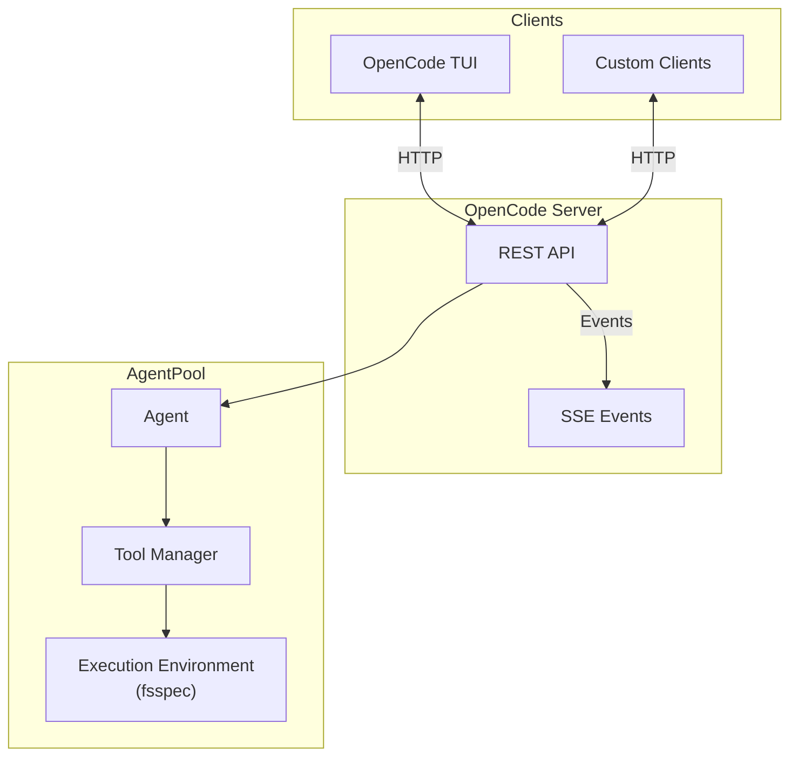

# OpenCode Server

The OpenCode server implements the OpenCode API protocol, enabling AgentPool agents to be used with the [OpenCode TUI](https://github.com/sst/opencode) and other compatible clients.

## What is OpenCode?

OpenCode is an open-source coding assistant with:

- **Terminal UI (TUI)** - Beautiful terminal interface
- **REST + SSE API** - Standard HTTP protocol with Server-Sent Events

The OpenCode API protocol can be used by any compatible client to interact with AgentPool agents.

## Quick Start

```bash
# Start the OpenCode server
agentpool serve-opencode config.yml --port 4096
```

See [`serve-opencode`](../cli/serve-opencode.md) for all CLI options.

## Connecting Clients

### OpenCode TUI

#### Installing OpenCode

```bash
# Using npm
npm install -g opencode

# Or using bun
bun install -g opencode
```

#### Connecting to AgentPool

In a separate terminal, point the TUI at your running server:

```bash
# Set the API URL and launch
OPENCODE_API_URL=http://localhost:4096 opencode
```

Or export it for the session:

```bash
export OPENCODE_API_URL=http://localhost:4096
opencode
```

The TUI will connect to your AgentPool server instead of its built-in backend. You'll see your configured agent(s) and can interact with them through the familiar OpenCode interface.

### Custom Clients

Any client that implements the OpenCode API protocol can connect to this server. The API uses standard REST endpoints with SSE for real-time events.

## Architecture



## Key Features

### Remote Filesystem Support

The OpenCode server uses [fsspec](https://filesystem-spec.readthedocs.io/) through the agent's execution environment, enabling:

- **Local files** - Standard filesystem access
- **Docker containers** - Files inside containers
- **SSH remotes** - Files on remote servers
- **Cloud sandboxes** - E2B, Modal, Daytona, etc.

```yaml
agents:
  remote_coder:
    type: claude_code
    env:
      type: docker
      image: python:3.13
```

The OpenCode TUI will seamlessly browse and edit files inside the Docker container!

### Slash Commands via MCP Prompts

Slash commands in OpenCode are mapped to MCP prompts:

```
/my-command arg1 arg2
```

If you have an MCP server with a prompt named `my-command`, it will be available as a slash command.

### Shell Execution

The `/session/{id}/shell` endpoint executes commands through:

1. `agent.env.execute_command()` if available (exxec environment)
2. Fallback to local subprocess

This means shell commands can execute inside remote environments.

## Agent Configuration

```yaml
# config.yml
agents:
  assistant:
    type: claude_code
    display_name: "AI Assistant"
    tools:
      - type: file_access
        edit_tool: batch
      - type: process_management
      - type: code
      - type: search
```

## API Endpoints

### Core Endpoints

| Method | Path | Description |
|--------|------|-------------|
| `GET` | `/global/health` | Server health check |
| `GET` | `/global/event` | SSE event stream |
| `GET` | `/project` | List projects |
| `GET` | `/path` | Current path info |

### Sessions

| Method | Path | Description |
|--------|------|-------------|
| `GET` | `/session` | List sessions |
| `POST` | `/session` | Create session |
| `GET` | `/session/{id}` | Get session details |
| `DELETE` | `/session/{id}` | Delete session |
| `POST` | `/session/{id}/abort` | Abort running session |

### Messages

| Method | Path | Description |
|--------|------|-------------|
| `GET` | `/session/{id}/message` | List messages |
| `POST` | `/session/{id}/message` | Send message |
| `POST` | `/session/{id}/shell` | Run shell command |
| `POST` | `/session/{id}/command` | Execute slash command |

### Files

| Method | Path | Description |
|--------|------|-------------|
| `GET` | `/file` | List directory |
| `GET` | `/file/content` | Read file |
| `GET` | `/find` | Search text in files |
| `GET` | `/find/file` | Find files by name |

### MCP & Commands

| Method | Path | Description |
|--------|------|-------------|
| `GET` | `/mcp` | MCP server status |
| `GET` | `/command` | List available commands |
| `GET` | `/agent` | List agents |

## SSE Events

The server broadcasts events via Server-Sent Events:

```typescript
// Session events
session.created
session.updated
session.deleted
session.status  // idle, busy

// Message events
message.updated
part.updated

// Todo events
todo.updated
```

Connect to `/global/event` or `/event` to receive events.

## Programmatic Usage

```python
from agentpool_server.opencode_server.server import OpenCodeServer
from agentpool import Agent

async def main():
    agent = Agent("assistant", model="openai:gpt-4o")
    
    async with agent:
        server = OpenCodeServer(
            host="127.0.0.1",
            port=4096,
            working_dir="/path/to/project",
            agent=agent,
        )
        await server.run()
```

## Environment Variables

The OpenCode TUI uses these environment variables:

| Variable | Description |
|----------|-------------|
| `OPENCODE_API_URL` | Server URL (e.g., `http://localhost:4096`) |

## Limitations

Current limitations:

- `prompt_async` not yet implemented (use sync `message`)
- `fork` not yet implemented
- Symbol search returns empty (LSP not integrated)

See [ENDPOINTS.md](https://github.com/phil65/agentpool/blob/main/src/agentpool_server/opencode_server/ENDPOINTS.md) for full implementation status.

## See Also

- [ACP Server](acp-server.md) - For IDE integration
- [MCP Server](mcp-server.md) - Expose tools via MCP
- [Execution Environments](../advanced/acp-integration.md#execution-environments) - Remote execution
